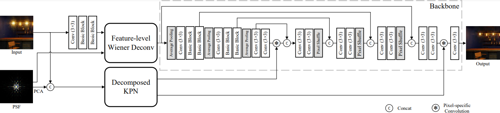
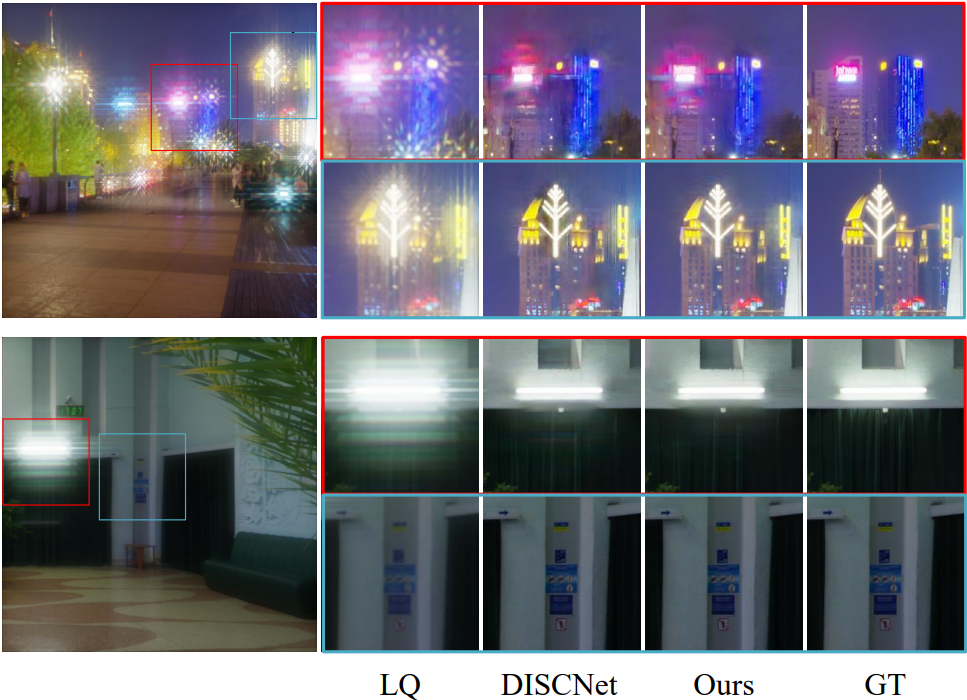
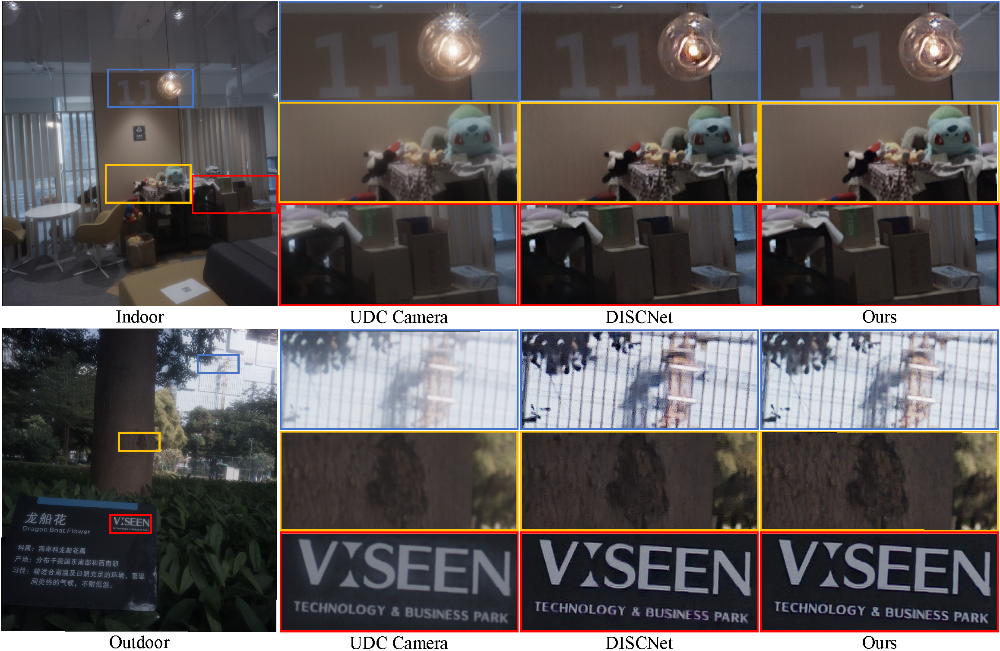
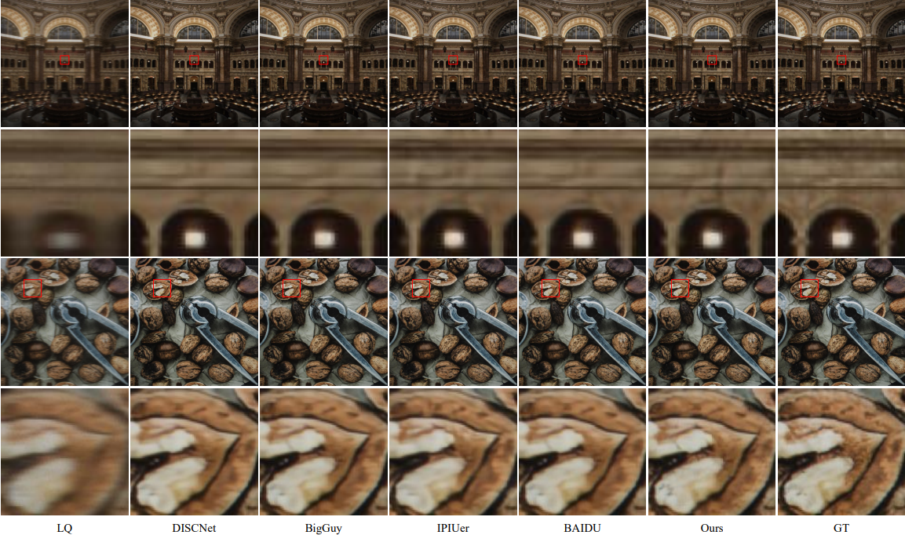
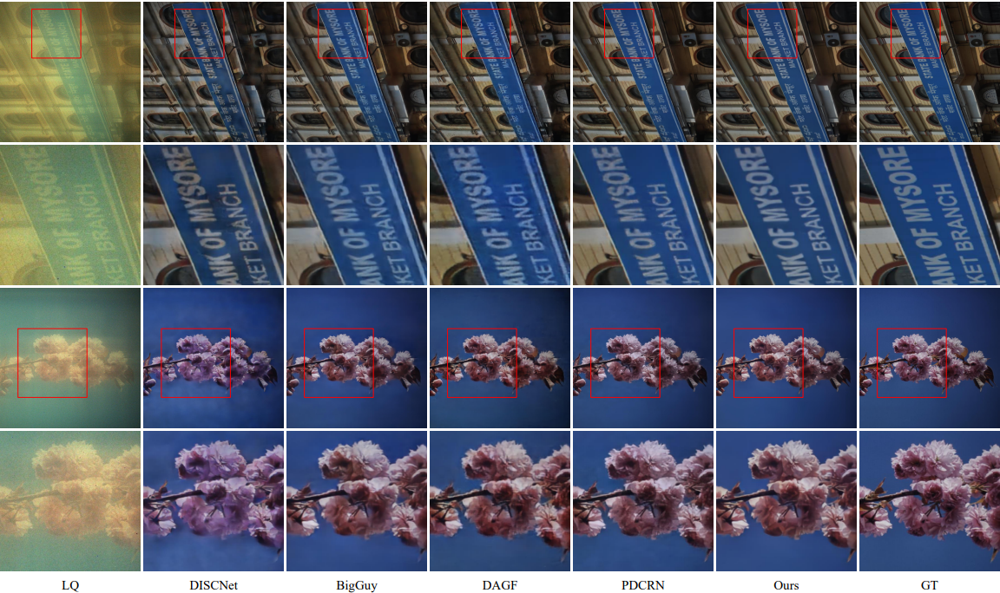

# De2Net  




**Overview of our proposed De2Net .** Two main components are embedded into the backbone architecture, *i.e.*, the feature-level Wiener deconvolution layer and the decomposed kernel prediction network.


## Dependencies and Installation

- Python >= 3.7 (Recommend to use [Anaconda](https://www.anaconda.com/download/#linux) or [Miniconda](https://docs.conda.io/en/latest/miniconda.html))
- [PyTorch >= 1.7](https://pytorch.org/)
- NVIDIA GPU + [CUDA](https://developer.nvidia.com/cuda-downloads)

1. Clone repo

   ```bash
   git clone https://github.com/HyZhu39/De2Net.git
   ```

1. Install Dependencies

   ```bash
   cd De2Net
   pip install -r requirements.txt
   ```

1. Install BasicSR

   Compile BasicSR without cuda extensions for DCN (Remember to modify the CUDA paths in `make.sh` and make sure that your GCC version: gcc >= 5) <br>

    ```bash
    sh ./make.sh
    ```


## Dataset Preparation

You can grab the data directly from [GoogleDrive](), unzip and put them into `./datasets`.

Alternatively, you can also grab the data from [BaiduDrive]().

Our pretrained models are released on [GoogleDrive](https://drive.google.com/file/d/1rDOBpeZZKlBiwSZ7J4m01DfSTmYLFaFU/view?usp=drive_link) or [BaiduDrive](https://pan.baidu.com/s/1xoJhrgfI3g-1s10VR4ND0w?pwd=D2NT).


## Get Started

### Test

We provide quick test code with the pretrained model. 

1. Download this repo, as well as the datasets and pretrained models from Google Drive or Baidu Drive, and unzip.

2. Modify the paths to dataset and pretrained model in the following yaml files for configuration.

   ```bash
   ./options/test/ZTE_test.yml
   ./options/test/TOLED_test.yml
   ./options/test/POLED_test.yml
   ./options/test/ZTE_test_real_data.yml
   ```

3. Run test code for **synthetic** data of  **ZTE**  dataset.

   ```bash
   python -u basicsr/test.py -opt "options/test/ZTE_test.yml" --launcher="none"
   ```

4. Run test code for **real** data of  **ZTE**  dataset.

   ```bash
   python -u basicsr/test.py -opt "options/test/ZTE_test_real_data.yml" --launcher="none"
   ```

5. Run test code for  **T-OLED**  dataset.

   ```bash
   python -u basicsr/test.py -opt "options/test/TOLED_test.yml" --launcher="none"
   ```

6. Run test code for  **P-OLED**  dataset.

   ```bash
   python -u basicsr/test.py -opt "options/test/POLED_test.yml" --launcher="none"
   ```

7. Check out the results in `./results`.

### Train

All logging files in the training process, *e.g.*, log message, checkpoints, and snapshots, will be saved to `./experiments` and `./tb_logger` directory.

1. Prepare datasets. Please refer to `Dataset Preparation`.

1. Modify config files.

   ```bash
   ./options/train/ZTE_train.yml
   ./options/train/TOLED_train.yml
   ./options/train/POLED_train.yml
   ```

1. Run training code for three different datasets. 

   ```bash
   python -u basicsr/train.py -opt "options/train/ZTE_train.yml" --launcher="none"
   python -u basicsr/train.py -opt "options/train/TOLED_train.yml" --launcher="none"
   python -u basicsr/train.py -opt "options/train/POLED_train.yml" --launcher="none"
   ```


## Results


Result on *synthetic* data of  **ZTE** dataset.


Result on *real* data of **ZTE** dataset.



Result on of **T-OLED** dataset.



Result on of **P-OLED** dataset.
